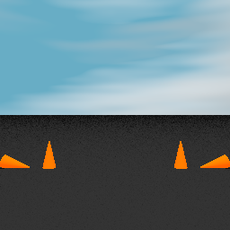
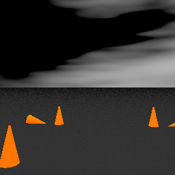

# konics
This is a brand new simulator designed to replace `cone-world` and `csim-server`. It gets rid of 
the awkward javascript-electron-localhost relay and provides a simple Python API for specifying 
and rendering autocross tracks. The easiest way to try it out is to spin up a Docker container 
and open a Jupyter notebook - this has been tested on macOS, Windows 10, and Ubuntu 16.





## usage
The below commands will (1) pull the latest version of `kevz/konics` from Docker Hub and (2) start 
the container and launch a new Jupyter instance on port 8888.

```
docker pull kevz/konics:v2
docker run -it -p 8888:8888 kevz/konics:v2 sh -c "jupyter notebook --ip='*' --no-browser"
```

If you navigate to `http://localhost:8888` in any web browser, you should see the standard Jupyter 
interface. For inspiration, check out the demo notebooks in the `examples` directory.

## tests
To run the tests, you need to be in the `tests` directory. Make sure to follow the instructions in
the console output and manually check the rendered images in `_output`.

```
cd konics/tests
python tests.py
```

## compatibility
It should work out-of-the-box on macOS if you have the scipy stack installed. Otherwise, you will 
need to build/install POV-Ray and SciPy. Make sure the `povray` binary can be found on your PATH 
and `konics` should work. Although `konics` should work with both Python 2.7+ and Python 3, I only
regularly test it on Python 3 so let me know if something is broken on 2.7 and I'll take a look.
