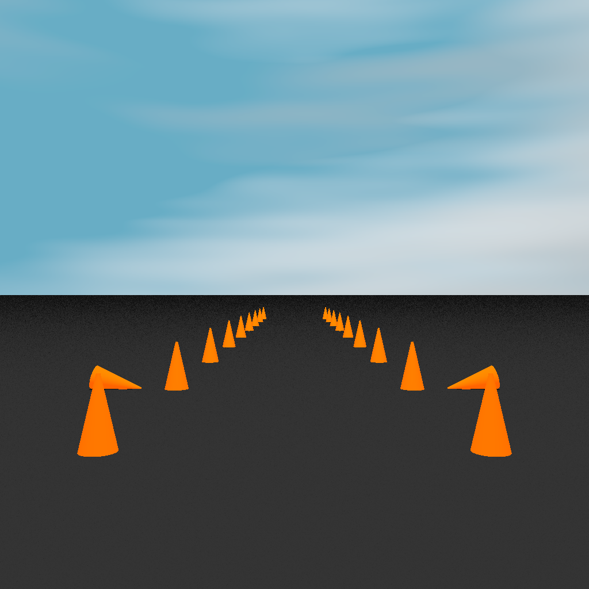

# konics
This is a brand new simulator designed to replace `cone-world` and `csim-server`. It gets rid of 
the awkward javascript-electron-localhost relay and provides a simple Python API for specifying 
and rendering autocross tracks.

To get the best performance, you should get macOS, install Python 3, and run this natively. But if
you just want to play around with `konics`, you can use the Docker image I wrote and hope I didn't 
mess things up too badly.

## usage
The below commands will (1) pull the latest version of `kevz/konics` for Docker Hub and (2) start 
the container and create a new Jupyter notebook. You should be able to open http://localhost:8888/
and create a new Python notebook.

```
docker pull kevz/konics:v1
docker run -it -p 8888:8888 kevz/konics:v1 sh -c "jupyter notebook --ip='*' --port=8888 --no-browser"
```

Paste the below code into your Python notebook and hit `shift-enter` to run it. After a second or 
two - we are making a ridiculously high resolution image after all - it should show the image.

```
from konics import *
import matplotlib.pyplot as plt

track = Track(size=1024) # ridiculously high-res

for i in range(10):
    track.add(Cone(-10, 20*i))
    track.add(Cone( 10, 20*i))

track.add(Cone(-15, 40, 0))
track.add(Cone( 15, 40, 180))

look_at = (0, 100)
location = (0, -10)
image = track.render(location, look_at)

plt.imshow(image)
plt.show()
```

## examples


